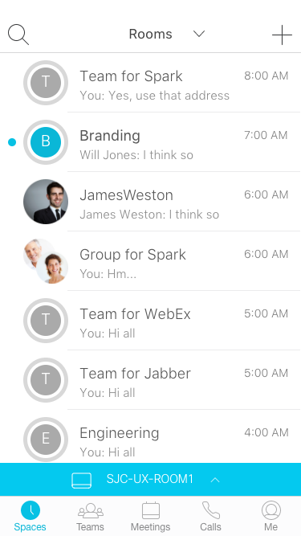

Title: Spark Pairing 2017
Desc: Mobile and Desktop Spark Prototype featuring the pairing functions
---

# Mobile Prototype

### Screen shot

## Prototype Link

[https://uxccds.github.io/SparkMobile/SparkMobilePairing/sparkMobilePair.html](https://uxccds.github.io/SparkMobile/SparkMobilePairing/sparkMobilePair.html)

## How-to

1) Please use Chrome (mobile mode) or IPhone (webapp mode) to view the prototype.

2) If you see any issues, try clearing your browser cache first.

3) Choose a version to continue.

# Desktop

## Link

[https://uxccds.github.io/Spark-Hype-MVO/devicepairing-desktop.html](https://uxccds.github.io/Spark-Hype-MVO/devicepairing-desktop.html)

## How-to

1) Please use Chrome to view this prototype.

# SparkBoard

## Prototype Link

[https://uxccds.github.io/SparkMobile/pair/page/sparkboardpair.html](https://uxccds.github.io/SparkMobile/pair/page/sparkboardpair.html)

## How-tos

1) Please use Chrome to view this prototype.

2) You can use the following hot keys to go to the screens.

key space -> black screen

key 1 -> the 'hello' screen.

key 2 -> the screen with activity balls

